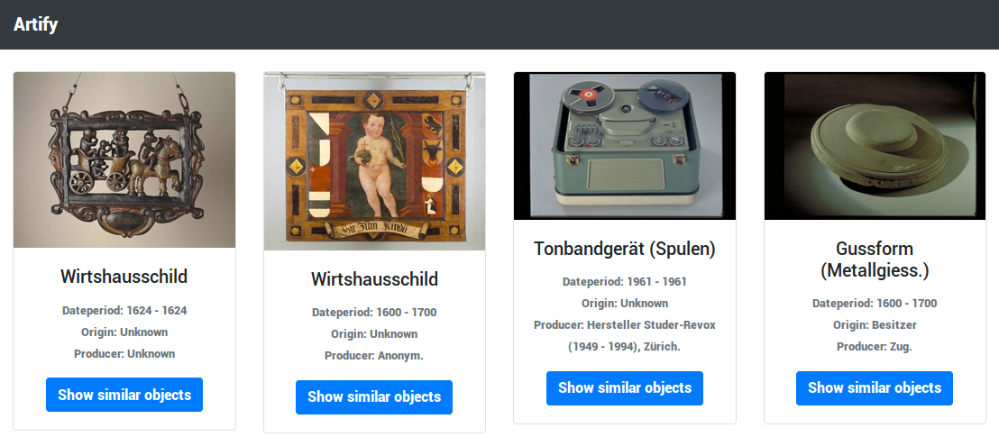

# Educated-Guess
Project from the 4th Swiss Open Cultural Data Hackathon in Zurich 2018

Goal:  Explore the collection in a new, interessting way

You have to find objects, which have similar metadata and try to match them. The displayed objects are (semi-)randomly selected from a dataset (eg. from SNM). From the metadata of the starting object, the app will search for three other objects:
- One which matches in 2+ metadata tags
- One which matches in 1 metadata tag
- One which is completly random.

If you choose the right one, the app will display three new objects accordingly to the way explained above.

Tags used from the datasets:
- OBJEKT Klassifikation (x)
- OBJEKT Webtext
- OBJEKT Datierung (x)
- OBJEKT → Herstellung (x)
- OBJEKT → Herkunft (x)

(x) = used for matching 

### Data

SNM https://opendata.swiss/en/organization/schweizerisches-nationalmuseum-snm

–> Build with two sets: Technologie und Brauchtum / Kutschen & Schlitten & Fahrzeuge 

### Links

Github: https://github.com/zack17/ocdh2018

Tech. Demo: https://zack17.github.io/ocdh2018/

Design Demo (not functional): https://tempestas.ch/artify/

### Team

- Anastasiya Korotkova
- Yaw Lam
- Jacqueline Martinelli
- Micha Reiser
- Dominic Studer

http://make.opendata.ch/wiki/project:personal_museum_guide

http://make.opendata.ch/wiki/event:2018-10
